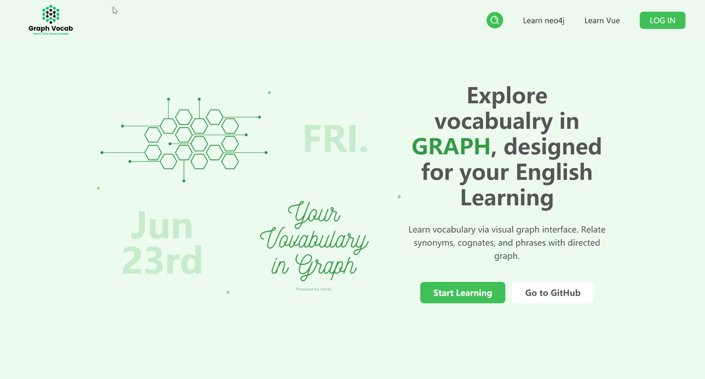
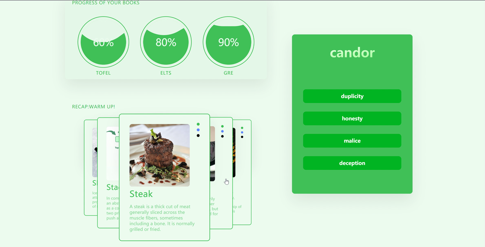
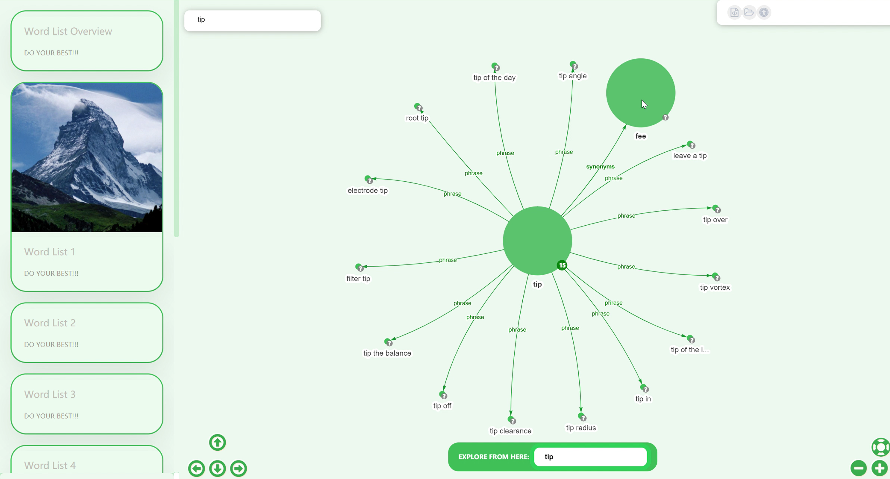
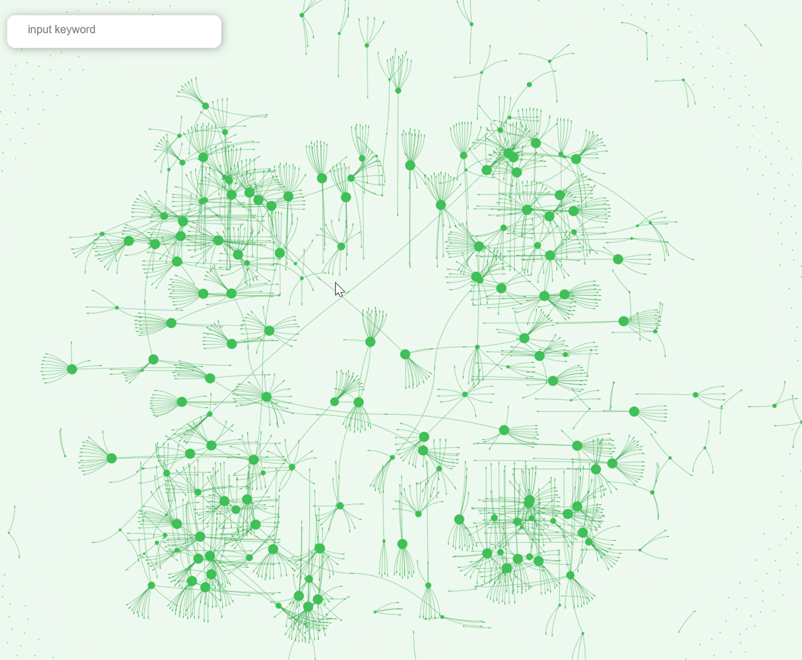
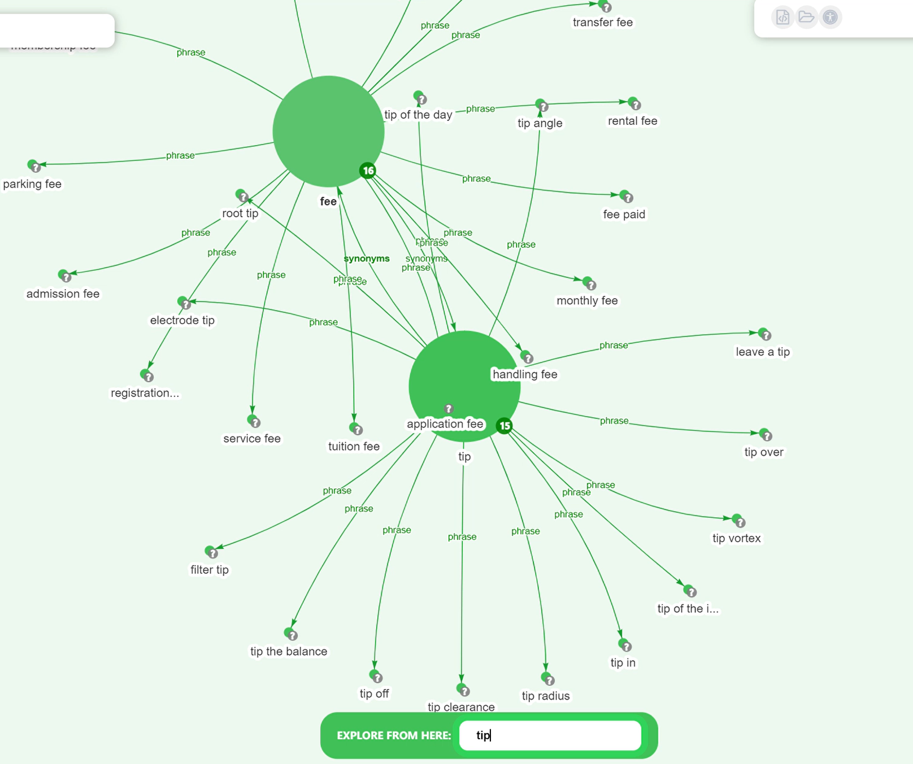
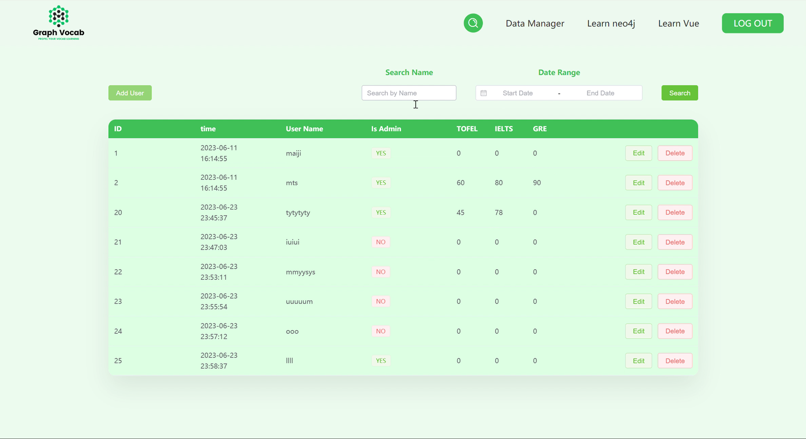
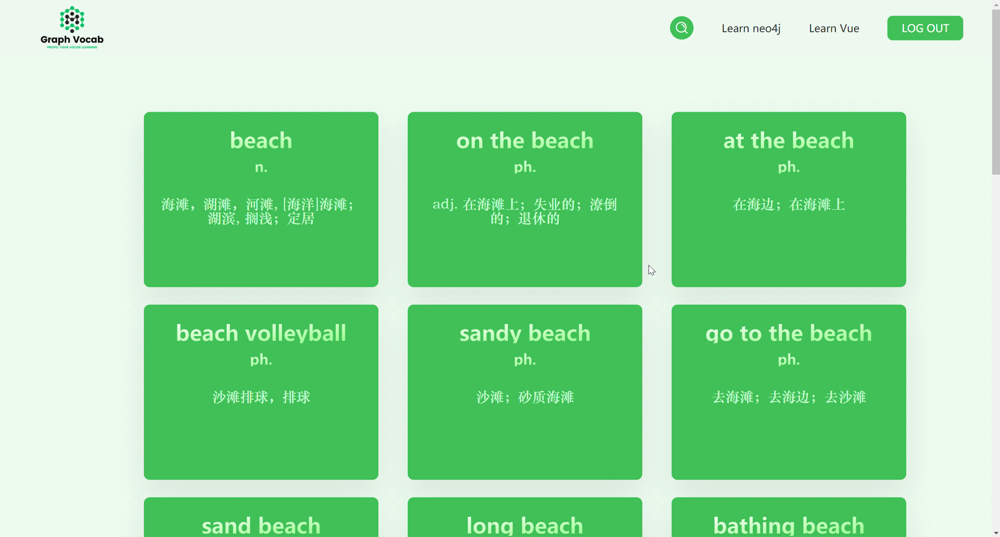

# Dandelion - Vocabulary Learning based on GRAPH

- Front end: https://github.com/Nozom1466
     - Vue VueRouter VueX
     - ElementPlus
     - [InteractiveGraph](https://github.com/grapheco/InteractiveGraph)
- Back end: https://github.com/0501MJ
     - Springboot
     - JWT
     - MyBatis
     - Nginx
- Database:
     - Neo4j
     - MySQL
- Dataset:
     - https://github.com/kajweb/dict

## Overview:
1. Welcome
   
2. main
   
3. graph
   
4. graph of CET4 Vocabulary
   
5. graph in expolre mode
   
6. manager
   
7. search
    
8. register / login
    

